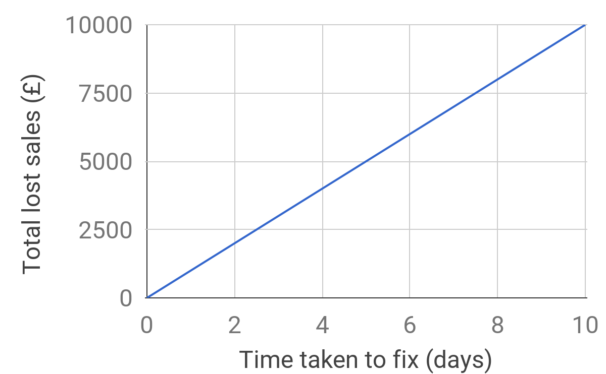
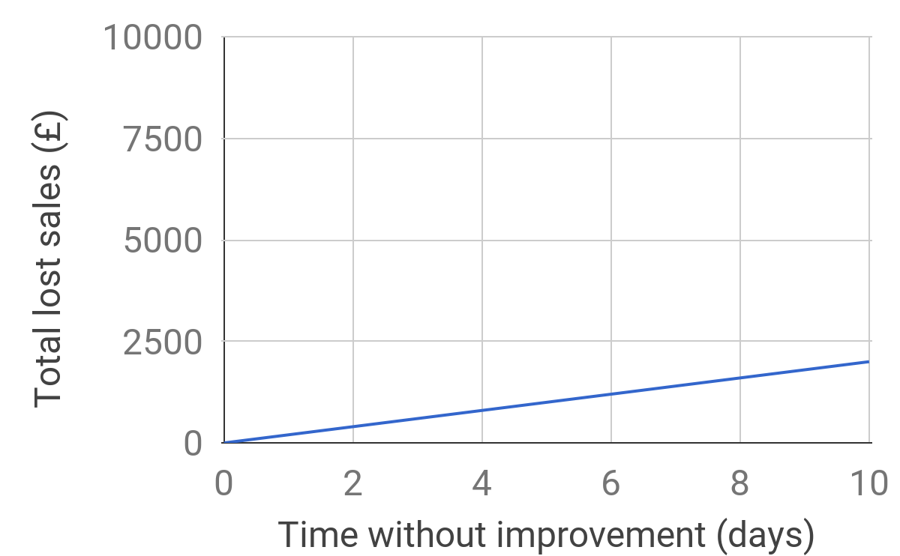
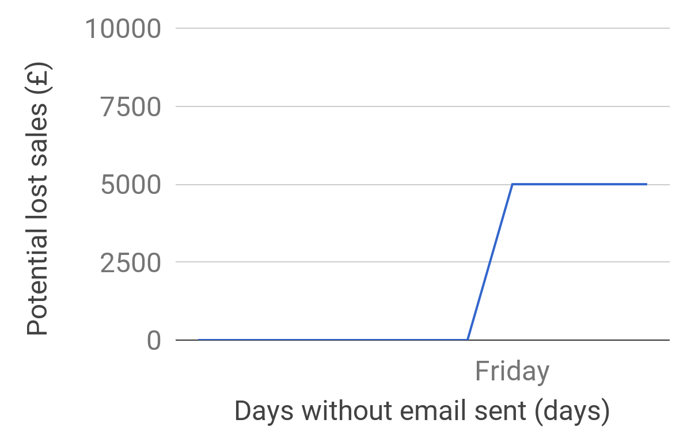

# Cost of delay
 
So, you’ve decided that responding to change over following a plan is going to be one of your guiding values.  You look at your plans and think “Gosh a lot of decisions went into creating this roadmap, I don’t want to be changing these without good reason”.  Then you start getting conflicted over what good reason is, “How can I be confident that rearranging the roadmap is for the best?”.
 
Before you get too worked up, I suggest pouring a glass of wine and familiarising yourself with a technique known as cost of delay modelling.

## Definition
 
Cost of delay is a modelling technique that examines how the accumulated cost of not completing something changes over time.

## Examples

### Super mega urgent tasks

If you host a ecommerce website with lots of traffic, the simplest cost of delay model would be the total lost sales over the time the site is down.

### Improvement tasks

If your ecommerce website isn’t compatible with the latest bit of technology sweeping the nation, you could estimate the cost of lost sales.

### External deadline tasks
 
Black Friday is coming, and you estimate that you could generate an extra £5K worth of sales on that day if you were able to send an email campaign out beforehand.

## Roadmap

So, let’s imagine a typical roadmap with 3 improvements.  You’ve just hired a team for 10 days which has capacity to work on 1 improvement at a time and you want to minimise the overall cost of delay.
 
* Improvement A you estimate to increase profits by £100/day taking 7 days
* Improvement B you estimate to reduce operating costs by £15/day taking 1 day
* Improvement C you estimate to generate a one time £1000 windfall taking 2 days
 
For each improvement we will model the accumulated cost of delay as the number of days without the improvement multiplied by its cost per day.  Given there is no cost associated with delaying Improvement C, we’ll model its cost per day as £0.  The accumulated cost of delay for C will be £0 no matter when it happens, but scheduling it before other improvements will impact the completion date of them.  To maximise the overall accumulated cost of delay we should leave it til last.
 
So let’s calculate the cost of delay when scheduling the improvements in the order they appear above AB.
* For A starting on the 1st day, the cost of delay is 7 days * £100 = £700
* For B starting on the 8th day, the cost of delay is 8 days * £15 = £120
* A grand sum of £820
 
Let’s calculate the cost of delay when scheduling the improvements BA.
* For B starting on the 1st day, the cost of delay is 1 day * £15 = £15
* For A starting on the 2nd day, the cost of delay is 8 days * £100 = £800
* A grand sum of £815
 
For this small example, we can see that the difference between scheduling the two ends up being small.  When factoring in the original estimation error, we conclude there is no strong evidence that starting A first or B first is more cost effective.  We might decide to schedule B first to allow more time to do research for improvement A.
 
## Conclusion
If you are able to place estimates on the value and duration of a piece of work, cost of delay can be a useful tool which gives quantitative backing to prioritisation decisions.  From the example above you should be able to formulate an argument for why one schedule is more expensive than another.  If you are interested in finding the most optimal schedule given a set of tasks, I suggest researching “cost of delay divided by duration”.
